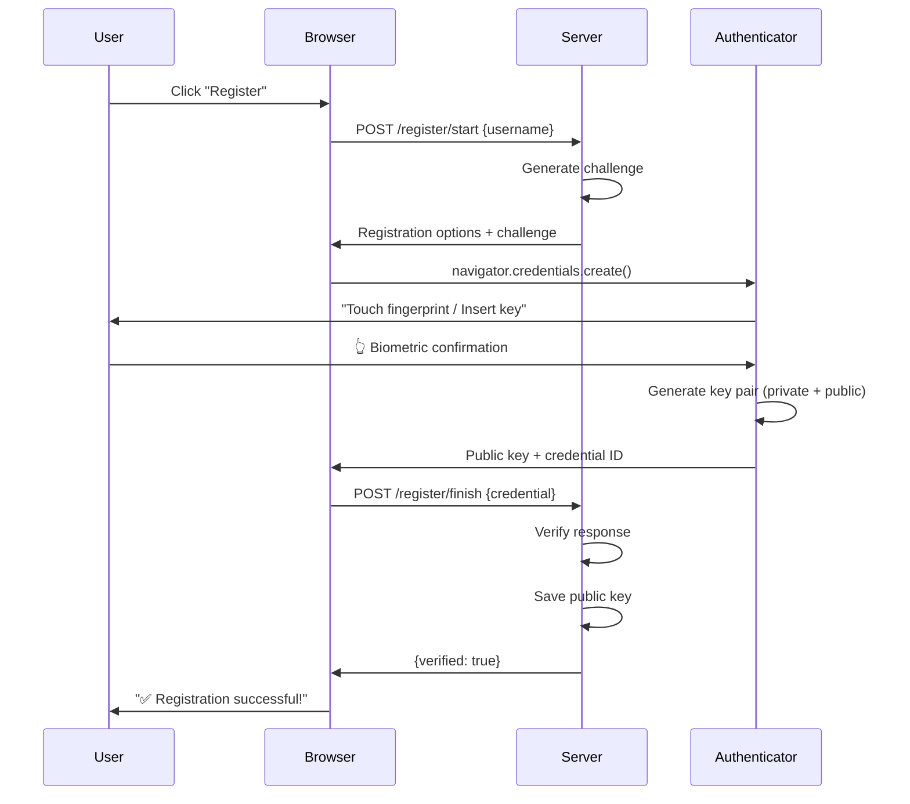
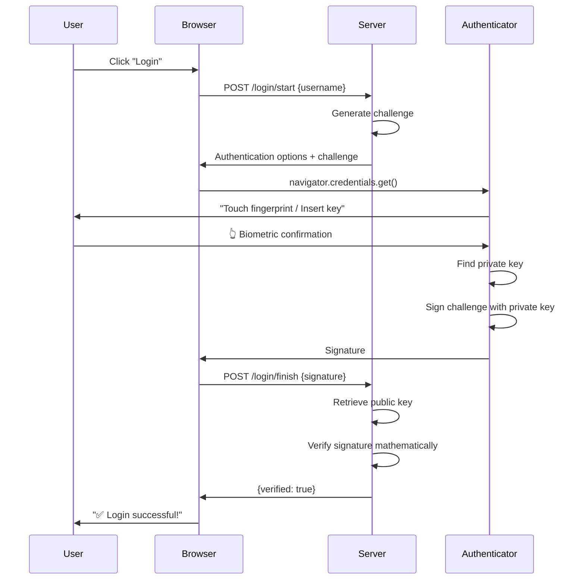
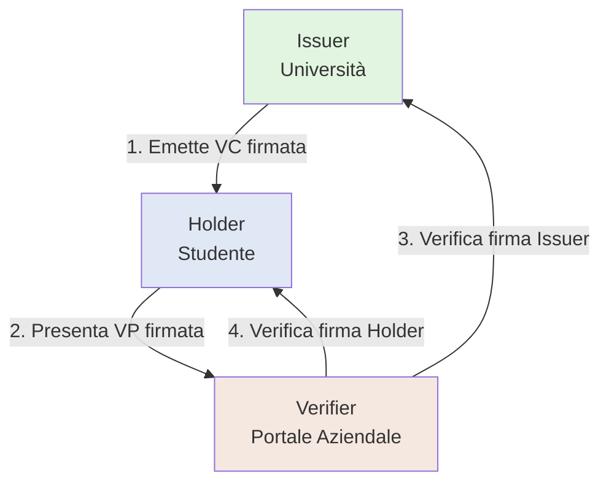
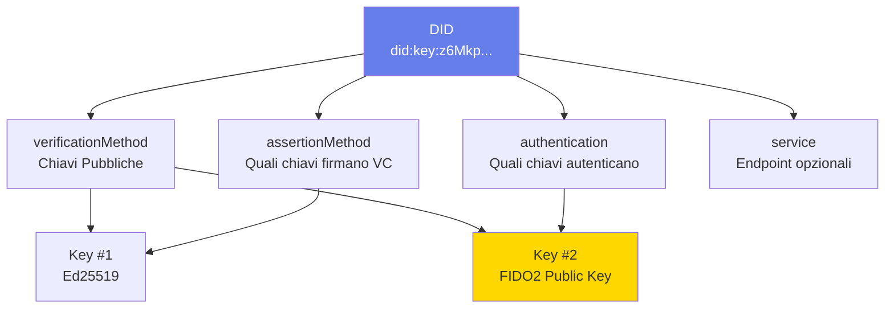
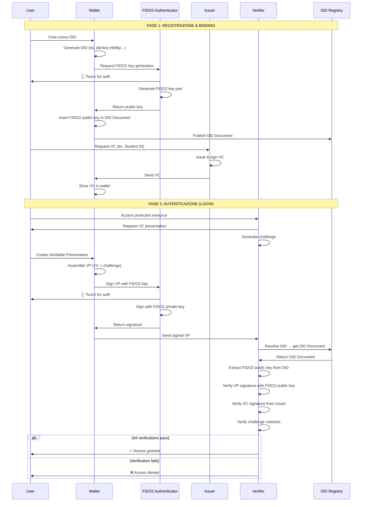
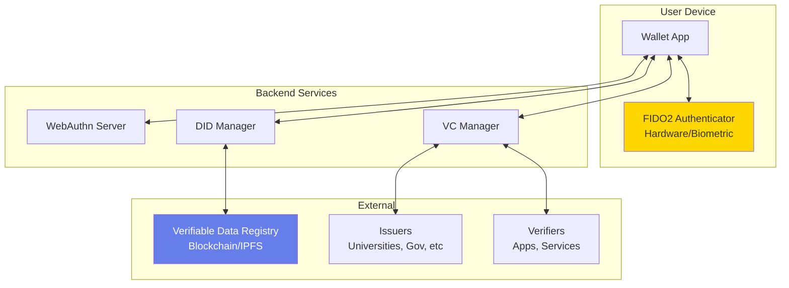
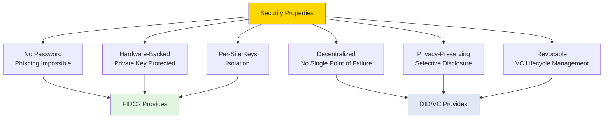

# WP1 - Diagrammi e Visualizzazioni

Questi diagrammi possono essere visualizzati su:
- https://mermaid.live (copia-incolla il codice)
- GitHub (supporta Mermaid nativamente)
- VS Code con estensione Mermaid

---

## 1. FIDO2 Registration Flow

---

## 2. FIDO2 Authentication Flow

---

## 3. DID/VC Trust Triangle

---

## 4. DID Document Structure

---

## 5. The Binding - Complete Flow

---

## 6. Architecture Overview

---

## 7. Security Model

---

## Come Usare Questi Diagrammi

### Opzione 1: Mermaid Live Editor
1. Vai su https://mermaid.live
2. Copia-incolla il codice del diagramma che ti interessa
3. Visualizza e esporta come PNG/SVG

### Opzione 2: VS Code
1. Installa estensione "Markdown Preview Mermaid Support"
2. Crea un file `.md` con questi diagrammi
3. Preview direttamente in VS Code

### Opzione 3: GitHub
1. Pusha questi diagrammi su GitHub in un file `.md`
2. GitHub li renderà automaticamente

---

## Tips per la Tesi

Questi diagrammi sono PERFETTI per:
- Capitolo 2 (Background) della tesi
- Slide della presentazione finale
- Documentazione D1.1
- Spiegare al relatore durante le review

Personalizzali come vuoi! Mermaid è molto flessibile.
